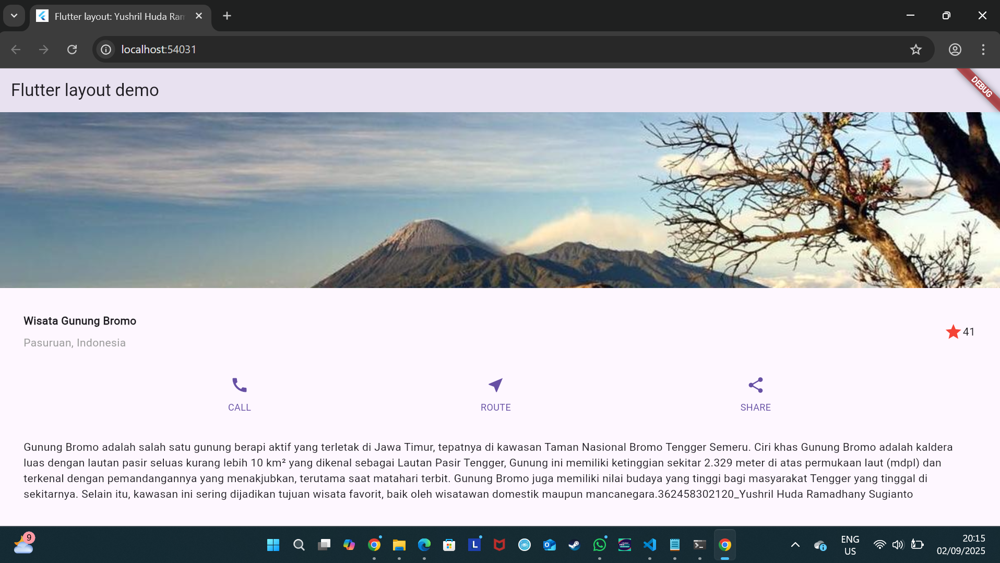
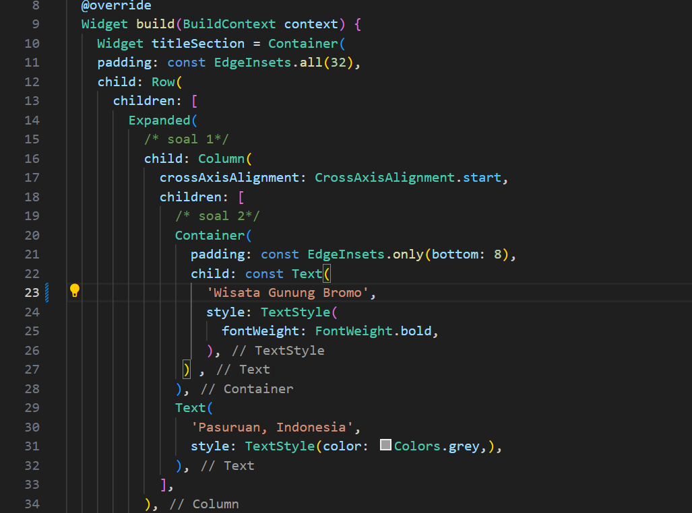

# layout_flutter

A new Flutter project.

## Getting Started

Gambar tersebut menunjukkan hasil project Flutter layout demo yang menampilkan informasi tentang Wisata Gunung Bromo, Bagian header adalah judul aplikasi yang berada di bagian paling atas tampilan (app bar). Pada gambar tertulis “Flutter layout demo”, yang berfungsi sebagai identitas dari aplikasi contoh yang sedang dibuat dengan Flutter.

Potongan kode pada gambar tersebut merupakan bagian dari method build dalam Flutter yang bertugas membentuk tampilan antarmuka. Pada awalnya dibuat sebuah widget bernama titleSection yang menggunakan Container dengan padding EdgeInsets.all(32) untuk memberi jarak di sekeliling isi.

kode pada gambar tersebut menampilkan dua bagian penting dalam Flutter. Pertama adalah widget textSection yang dibuat menggunakan Container dengan padding EdgeInsets.all(32) agar isi teks tidak menempel ke tepi. Di dalamnya terdapat Text panjang yang berisi deskripsi Gunung Bromo, menjelaskan keindahan, ketinggian, budaya masyarakat Tengger, hingga daya tarik wisata, serta diakhiri dengan identitas penulis.